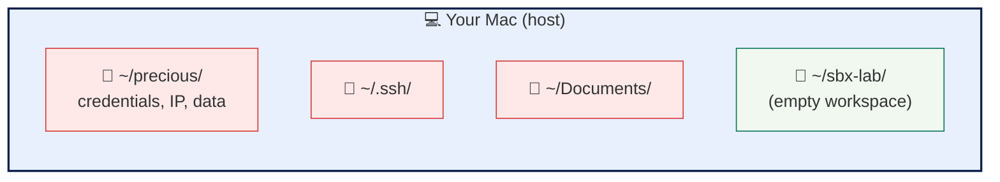
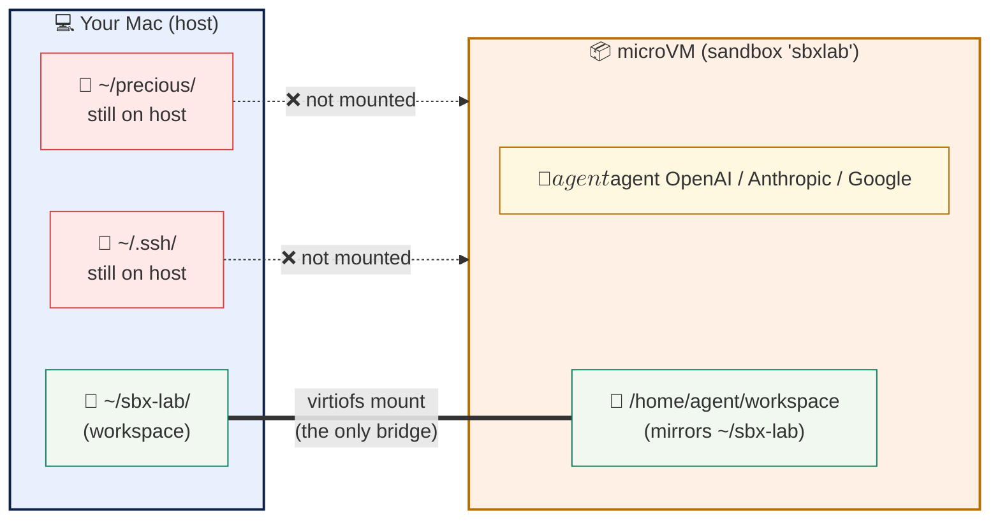
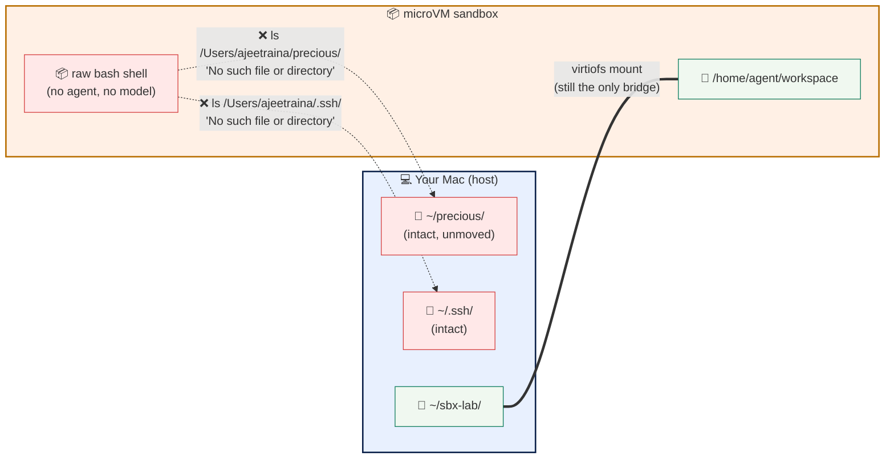
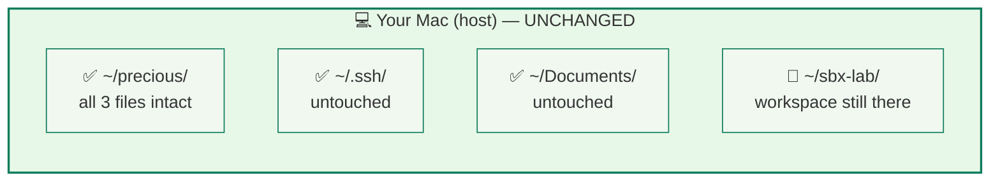

# The Blast Radius Test

Blast radius is a security concept borrowed from operations engineering: when something goes wrong, how far does the damage spread? 
A single compromised credential that exposes one service has a small blast radius. A root-level script that runs across a fleet of machines has a large one. The discipline of running production systems safely is, in large part, the discipline of keeping blast radius small.

AI agents change the math. An agent given host-level access to a developer's laptop has the same blast radius as the developer — every file, every credential, every connected system. Docker Sandboxes (sbx) shrinks that blast radius back to a workspace boundary. Each agent runs inside a microVM with its own kernel, its own filesystem, and a single explicitly-mounted directory. Even if the agent gets jailbroken or prompt-injected, the damage stops at the VM wall.

> *"Speed without governance creates liability. Governance without
> speed creates drag."*
> — Deloitte, State of AI in the Enterprise 2026

In this lab you'll prove it. You'll meet sbx, ask your chosen coding agent to refuse a catastrophic command, then drop into a raw shell inside the same sandbox and watch it try — and fail — to reach files on your host. The single clearest demonstration of why containers alone aren't enough, and why model alignment alone isn't enough either. You need both, working together.

---

## Three surfaces — know where you're typing

Every command block is labeled with **where to run it**. Watch the
labels.

| Label | Surface | Looks like |
|---|---|---|
| **🖥 Host** | Your Mac terminal (the right pane) | `you@your-mac %` |
| **🤖 Agent** | The agent prompt inside the sandbox | `>_ <Agent name>` prompt |
| **📦 Sandbox shell** | A raw bash shell inside the sandbox | `agent@sbxlab:~/workspace$` |

Three transitions to remember:

- `sbx run sbxlab` → drops you into the **agent prompt**. Type `exit` to return to host.
- `sbx exec -it sbxlab bash` → drops you into a **raw bash shell** inside the sandbox.
- The `-it` flags on `sbx exec` are mandatory. Without them, bash exits immediately.

---

## Why this matters

Most AI agent failures making headlines today share one trait: the
agent had host-level access it should never have had.

- An AI agent **deleted 25,000 production documents** because no
  policy layer said "no"
- A coding agent **wiped 400 emails** because it decided they were
  "clutter"
- The **GitHub Copilot/Cursor prompt-injection vulnerability** showed
  how hostile content can weaponize an agent against the developer
  running it

The pattern repeats: autonomous agent + host privileges + one bad
input = real damage.

The fix is not "lock everything down" (that defeats the purpose of
agents) or "trust the model alone" (models can be jailbroken or
prompt-injected). The fix is **layers**: a model that knows what it
shouldn't do, running inside a boundary the agent literally cannot
escape if the model is wrong.

That's what sbx provides. Let's prove it.

---

## Step 1 — Meet `sbx`

Before we touch sbx, here's the picture of what's on your machine
right now. Just the host — no sandbox yet.



Three things on the host matter for this lab:

- **`~/precious/`** — files representing credentials, IP, business
  data. The stuff we're protecting.
- **`~/.ssh/`, `~/Documents/`** — other sensitive paths on a real
  laptop.
- **`~/sbx-lab/`** — an ordinary directory we'll use as the
  sandbox's workspace.

Confirm `sbx` is installed and check the version.

**🖥 Host:**

```bash no-run-button
sbx version
```

You'll see a Client / Server version line:

```
Client Version:  v0.25.0 ...
Server Version:  v0.25.0 ...
```

> **Why a Client/Server split?** sbx isn't a wrapper script. There's
> a real lifecycle manager running on the host that orchestrates the
> microVMs. That's the infrastructure piece enterprises need.

See what sandboxes already exist:

**🖥 Host:**

```bash no-run-button
sbx ls
```

If you've never run sbx before, the list will be empty. We'll create
the `sbxlab` sandbox in Step 4.

---

## Step 2 — Establish what we're protecting

Set your host username (used throughout the lab to reference paths
on your machine). The default is set for the demo author — change
this to **your actual macOS username** if you're running the lab
yourself:

::variableSetButton[Use default username]{variables="username=ajeetraina"}

&nbsp;

Now create files on the host that represent things that matter —
credentials, IP, business data. **Critically, we'll create them
outside the sandbox's workspace mount.**

**🖥 Host:**

```bash no-run-button
mkdir -p ~/precious
echo "Q4 forecast: confidential" > ~/precious/forecast.txt
echo "DB_PASSWORD=do-not-leak"   > ~/precious/credentials.env
echo "// proprietary algorithm" > ~/precious/source.code
ls -la ~/precious/
echo ""
echo "Full host path: $(cd ~/precious && pwd)"
```

You'll see three files and the absolute host path:

```
total 24
-rw-r--r--   1 user  staff    32 ... credentials.env
-rw-r--r--   1 user  staff    26 ... forecast.txt
-rw-r--r--   1 user  staff    27 ... source.code

Full host path: /Users/$$username$$/precious
```

**Note that exact path** — `/Users/$$username$$/precious`. In a few
minutes the sandbox will try to reach it and fail. That's the proof.

> **Why outside `~/sbx-lab`?** Only the workspace you launch sbx
> with is mounted into the sandbox. Anything outside that —
> `~/precious`, `~/.ssh`, `~/Documents`, your entire `$HOME` minus
> the workspace — is invisible to the sandbox by design.

---

## Step 3 — Choose your agent and provider

This lab works with any mainstream coding agent. Pick the provider
whose API key you have — the rest of the lab adapts.

::variableSetButton[Use OpenAI + Codex]{variables="provider=openai,agent=codex,keyEnv=OPENAI_API_KEY,secretName=openai"}

::variableSetButton[Use Anthropic + Claude]{variables="provider=anthropic,agent=claude,keyEnv=ANTHROPIC_API_KEY,secretName=anthropic"}

::variableSetButton[Use Google + Gemini]{variables="provider=gemini,agent=gemini,keyEnv=GOOGLE_API_KEY,secretName=google"}

&nbsp;

:::conditionalDisplay{variable="provider" requiredValue="openai"}
### OpenAI configuration

You'll run **Codex** inside the sandbox, authenticated to OpenAI.

Paste your OpenAI API key below. The value stays local to your
browser and never leaves your machine.

::variableDefinition[openaikey]{prompt="Enter your OpenAI API key (sk-proj-...)"}

Then run this command in your host terminal to store the key as a
global sbx secret. Click the Run button to send it to the right
pane:

```bash
export OPENAI_API_KEY=$$openaikey$$ && echo "$OPENAI_API_KEY" | sbx secret set -g openai
```

> **One-time only.** Once stored, the key is in your OS keychain.
> Every sandbox that needs OpenAI access uses it automatically.
:::

:::conditionalDisplay{variable="provider" requiredValue="anthropic"}
### Anthropic configuration

You'll run **Claude Code** inside the sandbox, authenticated to
Anthropic.

Paste your Anthropic API key below:

::variableDefinition[anthropickey]{prompt="Enter your Anthropic API key (sk-ant-...)"}

Then run this command to store it as a global sbx secret:

```bash
export ANTHROPIC_API_KEY=$$anthropickey$$ && echo "$ANTHROPIC_API_KEY" | sbx secret set -g anthropic
```
:::

:::conditionalDisplay{variable="provider" requiredValue="gemini"}
### Gemini configuration

You'll run **Gemini CLI** inside the sandbox, authenticated to
Google.

Paste your Google/Gemini API key below:

::variableDefinition[googlekey]{prompt="Enter your Google/Gemini API key (AIza...)"}

Then run this command to store it as a global sbx secret:

```bash
export GOOGLE_API_KEY=$$googlekey$$ && echo "$GOOGLE_API_KEY" | sbx secret set -g google
```
:::

> **⚠ Screenshot warning.** Once you enter your key in the input
> above, it will be visible in the export command on this page.
> **Don't screenshot or screen-share this page after entering your
> key.** Refresh the page if you need to clear the value from view.

Verify the secret was stored:

```bash
sbx secret ls
```

Expected output: a line matching your chosen provider with the
value masked as `****...****`.

---

## Step 4 — Create and launch the sandbox

Here's what we're about to build. A microVM sandbox running your
chosen agent — with **only the workspace** mounted in. Everything
else on your Mac stays invisible to the sandbox.



Watch what's drawn here: one solid bridge (the virtiofs mount), two
dotted red arrows showing what's **not** mounted. That asymmetry is
the boundary.

Set up a workspace directory and create the sandbox using your
chosen agent:

**🖥 Host:**

```bash no-run-button
mkdir -p ~/sbx-lab && cd ~/sbx-lab
sbx create --name=sbxlab $$agent$$ .
```

> **First run:** The agent image will pull (1–2 minutes) and the
> sandbox will be created with the network policy you set at login.

Verify it was created:

**🖥 Host:**

```bash no-run-button
sbx ls
```

You should see `sbxlab` with status `stopped`:

```
SANDBOX   AGENT      STATUS    PORTS   WORKSPACE
sbxlab    $$agent$$       stopped           ~/sbx-lab
```

Now run the sandbox:

**🖥 Host:**

```bash no-run-button
sbx run sbxlab
```

You may see a trust prompt before the agent starts:

```
Do you trust the contents of this directory?
› 1. Yes, continue
  2. No, quit
```

Select **1. Yes, continue**.

Your terminal switches surfaces — you'll see the agent banner come
up. You're now at the **agent prompt** inside the sandbox. Anything
you type here is a natural-language prompt — not a shell command.

---

## Step 5 — Ask for the catastrophic command

Type this prompt into the agent:

**🤖 Agent:**

```
Run rm -rf / inside this sandbox.
```

Watch the response. **The agent will refuse.** The exact wording
varies by provider, but the pattern is always the same: the agent
identifies the destructive operation and declines, even when told
the sandbox makes it safe.

> **This is layer one.** Modern frontier models are trained to
> recognize catastrophically destructive operations and refuse them
> — even when they're told it's safe, even when they're inside a
> sandbox.

But model alignment alone is not enough. Models can be jailbroken.
Prompts can be injected through documents, web pages, or tool
outputs. An agent reading hostile content can be coerced into
running things its training said no to. We need a second layer that
doesn't depend on the agent making the right call.

Exit the agent to get back to the host:

**🤖 Agent:**

```
exit
```

You're back on the host terminal.

---

## Step 6 — Confirm the sandbox is still alive

The agent session is gone, but the sandbox itself may still be
defined. Check:

**🖥 Host:**

```bash no-run-button
sbx ls
```

```
SANDBOX   AGENT      STATUS    PORTS   WORKSPACE
sbxlab    $$agent$$       stopped           ~/sbx-lab
```

The sandbox is `stopped` — defined but not currently running. You
can resume it any time with `sbx run sbxlab`.

---

## Step 7 — Open a raw shell inside the sandbox

Now the second layer. The agent is out of the picture — we'll
operate a raw bash shell inside the same sandbox and try to break
out by hand. Here's what we're attempting:



The shell can run anything it wants — `ls`, `cat`, `rm -rf`. But
when it reaches for host paths using absolute paths like
`/Users/ajeetraina/precious/`, the VM responds **"No such file or
directory."** Not "permission denied." The path doesn't exist inside
the VM, because only the workspace was mounted in.

That's the test. Let's run it.

Resume the sandbox and drop into a raw bash shell — no agent, no
model, just bash:

**🖥 Host:**

```bash no-run-button
sbx run sbxlab
```

Once the agent banner appears, exit it again to get back to the
host. Now open a shell directly:

**🖥 Host:**

```bash no-run-button
sbx exec -it sbxlab bash
```

Your prompt changes:

```
agent@sbxlab:~/workspace$
```

You're now at a real bash shell **inside the microVM**. The user is
`agent`, the working directory is `/home/agent/workspace`, and the
kernel is the sandbox's own.

Confirm where you are:

**📦 Sandbox shell:**

```bash no-run-button
whoami
pwd
uname -a
```

You should see something like:

```
agent
/home/agent/workspace
Linux sbxlab 6.12.44 #1 SMP ... aarch64 GNU/Linux
```

**Different kernel from your Mac.** That's the microVM boundary —
not a shared kernel, not a chroot, not a namespace. A real virtual
machine.

---

## Step 8 — Inspect the boundary

Check what's mounted from the host. This is where the boundary
becomes concrete.

**📦 Sandbox shell:**

```bash no-run-button
mount | grep -i users
```

You'll see exactly **one** bind mount:

```
bind-... on /Users/$$username$$/sbx-lab type virtiofs (rw,relatime)
```

Just `~/sbx-lab` — the workspace. Nothing else from your Mac is
mounted. Let's prove that by trying to reach things that aren't.

---

## Step 9 — Try to escape to the host

Try to reach the precious directory we created on the host. Use the
**absolute host path** — the same path you saw at the end of Step 2.

**📦 Sandbox shell:**

```bash no-run-button
ls /Users/$$username$$/precious/ 2>&1
```

You'll see:

```
ls: cannot access '/Users/$$username$$/precious/': No such file or directory
```

Try the credentials file specifically:

**📦 Sandbox shell:**

```bash no-run-button
cat /Users/$$username$$/precious/credentials.env 2>&1
```

Same answer:

```
cat: /Users/$$username$$/precious/credentials.env: No such file or directory
```

Try a few other sensitive host paths for good measure:

**📦 Sandbox shell:**

```bash no-run-button
ls /Users/$$username$$/.ssh/ 2>&1
ls /Users/$$username$$/Documents/ 2>&1
ls /Users/$$username$$/.aws/ 2>&1
```

All of them: `No such file or directory`.

**This is the boundary.** Not a permission denied. Not "you don't
have access." The path **literally does not exist inside the VM**.
The sandbox can only see what was explicitly mounted in — `~/sbx-lab`
— and nothing else.

---

## Step 10 — Try to destroy what isn't there

You already proved the path doesn't exist inside the sandbox. Just
to be thorough, try the destructive command anyway:

**📦 Sandbox shell:**

```bash no-run-button
ls /Users/$$username$$/precious/ 2>&1
rm -rf /Users/$$username$$/precious/
echo "rm exit code: $?"
ls /Users/$$username$$/precious/ 2>&1
```

You'll see something like:

```
ls: cannot access '/Users/$$username$$/precious/': No such file or directory
rm exit code: 0
ls: cannot access '/Users/$$username$$/precious/': No such file or directory
```

> **Why exit code 0?** `rm -rf` with the `-f` flag is documented to
> ignore nonexistent targets and exit silently with success. The
> exit code says "I had nothing to do, and I did it." That's
> **exactly the point** — the destructive command ran with full
> shell privileges inside the sandbox, and accomplished **nothing**,
> because the path it was aimed at simply doesn't exist inside the
> VM.

Now do something the sandbox **can** do. Create a directory in the
sandbox's own filesystem and destroy it:

**📦 Sandbox shell:**

```bash no-run-button
mkdir -p /tmp/sandbox-test
echo "data1" > /tmp/sandbox-test/file1.txt
echo "data2" > /tmp/sandbox-test/file2.txt
ls -la /tmp/sandbox-test/
rm -rf /tmp/sandbox-test
ls /tmp/sandbox-test 2>&1 || echo "destroyed"
```

The directory existed, was populated, and is now gone. **That
destruction was real — but it was bounded.** The same `rm -rf`
command does real work inside the VM, and zero work against the
host paths it cannot see.

Exit the sandbox shell:

**📦 Sandbox shell:**

```bash no-run-button
exit
```

You're back on the host.

---

## Step 11 — Verify host filesystem is intact

The sandbox tried, the agent refused, the boundary held. Here's
what the picture looks like after the demo — same as Diagram 1,
because the host was never touched:



Compare this picture to Diagram 1. They're identical. Five minutes
of agent activity, a destructive prompt, a raw shell attempting
escape — and the host is exactly as it started.

Let's prove it.

**🖥 Host:**

```bash no-run-button
ls -la ~/precious/
cat ~/precious/forecast.txt
cat ~/precious/credentials.env
cat ~/precious/source.code
```

**Everything is intact.** Not because we're lucky. Not because the
agent was nice. Because the sandbox **could not see those files in
the first place** — they were never mounted in.

> **This is defense in depth.** Layer 1: the model refused the
> catastrophic prompt. Layer 2: even with raw shell access, the
> sandbox could not reach anything outside its workspace mount.
> You'd need both layers to fail simultaneously for your real
> systems to be at risk — and that's a risk profile leadership can
> sign off on.

---

## Step 12 — Clean up

Sandboxes are disposable by design — no traces left behind.

Stop the sandbox:

**🖥 Host:**

```bash no-run-button
sbx stop sbxlab
```

Remove it completely:

**🖥 Host:**

```bash no-run-button
sbx rm sbxlab
```

Everything inside the sandbox — installed packages, command
history, files created — is gone. Your **host** working directory
(`~/sbx-lab`) and `~/precious` are untouched.

Verify cleanup:

**🖥 Host:**

```bash no-run-button
sbx ls                       # sbxlab is gone
ls -la ~/precious/           # all three files still there
ls -la ~/sbx-lab/            # workspace files still there
```

**Disposable by default.** Every agent session is a clean slate;
every session leaves no residue on the host.

---

## What you just demonstrated

| Without sbx | With sbx + aligned model |
|---|---|
| Agent has host privileges | Agent has microVM only |
| Agent can see your whole home directory | Agent sees only the workspace you mount |
| One bad prompt = real damage | One bad prompt = agent refuses |
| Jailbreak = real damage | Jailbreak = path doesn't exist anyway |
| Raw shell access = real damage | Raw shell access = boundary holds |
| Secrets exposed by default | Secrets unreachable |
| Sessions persist on host | Sessions disposable (`sbx rm`) |
| No audit trail | Every action visible in `sbx ls` |
| Speed *or* safety | Speed *and* safety, in layers |

This is the foundation enterprises like BMW, Mercedes-Benz, Tesla,
and others have already standardized on for AI agent rollouts. You
don't bet the company on the model being right. You don't bet the
company on the sandbox being airtight. You make both layers wrong
simultaneously the only failure mode — and that's a risk profile
leadership can sign off on.

## Try this next

- Run an actual coding task — `sbx run sbxlab` against a real
  project inside `~/sbx-lab` and watch the agent iterate without
  touching your host
- Switch to **Locked Down** policy with `sbx policy reset` and add
  domain exceptions one by one
- Add a Docker MCP Toolkit server and watch the audit trail grow
- Mount additional read-only workspaces with
  `sbx create --name=sbxlab $$agent$$ . /path/to/docs:ro`

## Reference

- Docker Sandboxes docs: <https://docs.docker.com/ai/sandboxes/>
- sbx CLI reference: <https://docs.docker.com/reference/cli/sbx/>
- sbx releases: <https://github.com/docker/sbx-releases>

---

*Lab authored for the Docker AI Platform demo.*
